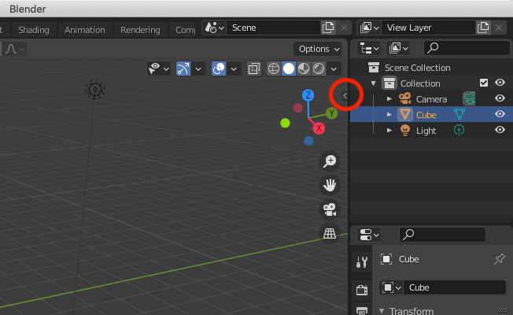
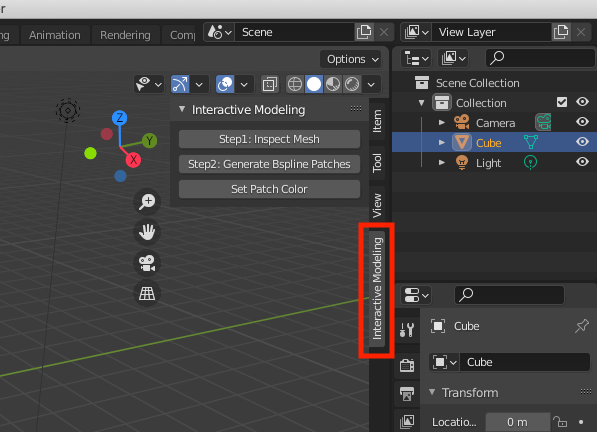
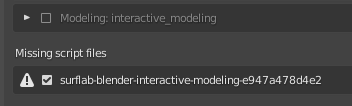
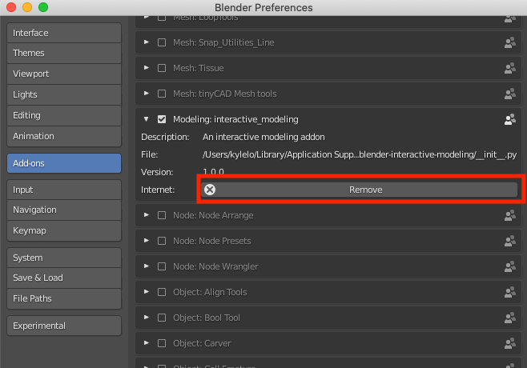

# README #

Two ways to install interactive modeling

Repo:
https://bitbucket.org/surflab/blender-interactive-modeling/src/master/

Method 1:
Put folder of interactive modeling in the addon folder of Blender (on Linux, the path would be a little different)
```
cd /Applications/Blender.app/Contents/Resources/2.82/scripts/addons/
git clone https://USER_NAME@bitbucket.org/surflab/blender-interactive-modeling.git
```

Method 2:
Install addon in Blender using zip file
Launch Blender >> Edit >> Preferences >> Add-ons >> Install >> select "blender-interactive-modeling.zip"

-- Kyle

### Execute Addon in Blender ###
#### 1. How to find the installed addon? ####
Click on the small left angle bracket to expand the panel



Then switch to the tab of interactive modeling



### Troubleshooting ###
#### 1. Not able to install addon properly ####
The error such as



Can be solved by removing old addon


